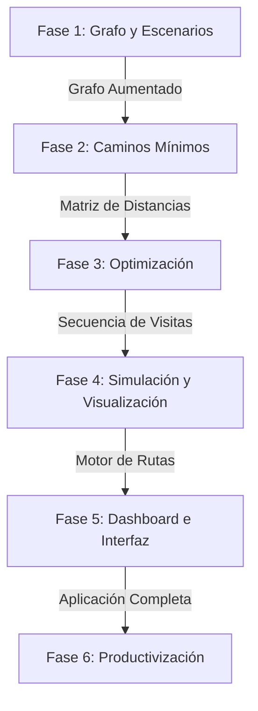

# Roadmap Consolidado: Optimización de Rutas

Este documento unifica tu roadmap original con mis sugerencias técnicas para lograr un sistema de optimización de rutas robusto, escalable y visualmente impactante.

---

## 📋 Estado del Proyecto y Próximos Pasos

### 🔹 Fase 1: Base Geográfica y Generación de Escenarios (Completado)
* [x] **Descarga de Ciudad (OSMnx)**: Descarga y almacenamiento de Concordia en formato `.graphml` ([download_city.py](file:///c:/Users/GAMER/PROYECCTO_OPTIMIZACION_RUTS/src/download/download_city.py)).
* [x] **EDA (Análisis Exploratorio de Datos)**: Análisis estadístico de calles, sentidos y conectividad ([graph_analysis.py](file:///c:/Users/GAMER/PROYECCTO_OPTIMIZACION_RUTS/src/analysis/graph_analysis.py)).
* [x] **Configuración**: Parámetros globales y tipos de calles válidas ([config.py](file:///c:/Users/GAMER/PROYECCTO_OPTIMIZACION_RUTS/src/config.py)).
* [x] **Entidades**: Modelado de datos en [entities.py](file:///c:/Users/GAMER/PROYECCTO_OPTIMIZACION_RUTS/src/scenario/entities.py).
* [x] **ScenarioGenerator**: Generación reproducible de clientes y depósitos sobre las aristas ([generator.py](file:///c:/Users/GAMER/PROYECCTO_OPTIMIZACION_RUTS/src/scenario/generator.py)).
* [x] **GraphAugmenter**: Inserción geométrica óptima de clientes en el grafo vial sin alterar el original ([augment_graph.py](file:///c:/Users/GAMER/PROYECCTO_OPTIMIZACION_RUTS/src/graph/augment_graph.py)).

### ⬜ Fase 2: Validación y Robustez del Grafo Aumentado
* [ ] **Validación del Grafo Aumentado**:
  * [ ] **Visualización**: Robustecer [graph_plotter.py](file:///c:/Users/GAMER/PROYECCTO_OPTIMIZACION_RUTS/src/visualization/graph_plotter.py) para que visualice correctamente inserciones complejas (varios clientes en una misma cuadra).
  * [ ] **Tests Unitarios**: Extender [test_augment_graph.py](file:///c:/Users/GAMER/PROYECCTO_OPTIMIZACION_RUTS/tests/test_augment_graph.py) cubriendo casos borde (depósito y cliente en la misma arista, coordenadas idénticas, calles de un solo sentido).

### 🔹 Fase 3: Caminos Mínimos y Matriz de Costos (Completado)
* [x] **Dijkstra Custom vs. NetworkX**:
  * [x] Implementación propia de Dijkstra punto-a-punto adaptada a las aristas del grafo aumentado ([dijkstra.py](file:///C:/Users/GAMER/PROYECCTO_OPTIMIZACION_RUTS/src/routing/dijkstra.py)).
  * [x] **Benchmark**: Evaluar el tiempo de ejecución y uso de memoria de nuestra implementación vs `nx.shortest_path_length` en grafos grandes ([benchmark.py](file:///C:/Users/GAMER/PROYECCTO_OPTIMIZACION_RUTS/src/routing/benchmark.py)).
* [x] **A* (A-Estrella)**:
  * [x] Implementar A* con una función heurística basada en la distancia de Haversine (usando las coordenadas de latitud/longitud de los nodos) para acelerar consultas individuales ([astar.py](file:///C:/Users/GAMER/PROYECCTO_OPTIMIZACION_RUTS/src/routing/astar.py)).
* [x] **Generador de Matriz de Distancias (y Tiempos)**:
  * [x] Crear una clase `CostMatrixGenerator` que calcule las distancias mínimas en un formato matricial de $N \times N$ (donde $N = \text{clientes} + \text{depósito}$) ([matrix.py](file:///C:/Users/GAMER/PROYECCTO_OPTIMIZACION_RUTS/src/routing/matrix.py)).
  * [x] Agregar cálculo de tiempos estimados de viaje según el tipo de calle (`maxspeed`).

### 🔹 Fase 4: Algoritmos de Optimización de Rutas (Parcialmente completado)
* [x] **TSP (Travelling Salesperson Problem)**:
  * [x] Solución heurística (Nearest Neighbor + Búsqueda Local 2-Opt) para un único vehículo ([tsp.py](file:///C:/Users/GAMER/PROYECCTO_OPTIMIZACION_RUTS/src/optimization/tsp.py)).
* [ ] **VRP (Vehicle Routing Problem)**:
  * [x] Extender el problema a múltiples vehículos considerando capacidades de carga (`CVRP`) con heurística greedy ([vrp.py](file:///C:/Users/GAMER/PROYECCTO_OPTIMIZACION_RUTS/src/optimization/vrp.py)).
  * [ ] Agregar ventanas de tiempo (`VRPTW`).
  * [ ] Integración de resolvedor matemático como **Google OR-Tools** o implementaciones metaheurísticas.
* [x] **Reconstrucción del Camino Geométrico**:
  * [x] Traducir el orden óptimo de clientes de vuelta a una lista ordenada de nodos/aristas del grafo vial para poder trazar el camino exacto calle por calle ([reconstruct.py](file:///C:/Users/GAMER/PROYECCTO_OPTIMIZACION_RUTS/src/optimization/reconstruct.py)).

### 🔹 Fase 5: Simulación Logística y Visualización (Completado inicial)
* [x] **Visualización de Recorridos**:
  * [x] Graficar las rutas resultantes diferenciando cada vehículo con colores llamativos y flechas de sentido sobre el mapa de Concordia ([route_plotter.py](file:///C:/Users/GAMER/PROYECCTO_OPTIMIZACION_RUTS/src/visualization/route_plotter.py)).
* [x] **Simulación Logística**:
  * [x] Crear un simulador temporal que muestre el avance de los vehículos, calculando el momento de llegada a cada cliente e identificando posibles cuellos de botella como esperas, llegadas tarde o congestión simulada ([logistics.py](file:///C:/Users/GAMER/PROYECCTO_OPTIMIZACION_RUTS/src/simulation/logistics.py)).

### 🔹 Fase 6: Interfaz y Despliegue (Productivización completada inicial)
* [x] **Script Runner Principal (`main.py`)**:
  * [x] Archivo de entrada interactivo para correr simulaciones desde la terminal ([main.py](file:///C:/Users/GAMER/PROYECCTO_OPTIMIZACION_RUTS/main.py)).
* [x] **Dashboard Interactivo**:
  * [x] Aplicación web ligera con **Streamlit** para elegir cantidad de clientes, vehículos, capacidad y algoritmo, ejecutar la optimización y ver mapa/resultados ([app.py](file:///C:/Users/GAMER/PROYECCTO_OPTIMIZACION_RUTS/src/dashboard/app.py)).
* [x] **Documentación**:
  * [x] Guía de arquitectura, API docs y manual de uso ([docs](file:///C:/Users/GAMER/PROYECCTO_OPTIMIZACION_RUTS/docs)).
* [x] **Docker & Infraestructura**:
  * [x] `Dockerfile` con dependencias geoespaciales del sistema (`GDAL`, `PROJ`, `GEOS`) y dependencias Python ([Dockerfile](file:///C:/Users/GAMER/PROYECCTO_OPTIMIZACION_RUTS/Dockerfile)).
* [x] **CI/CD**:
  * [x] Pipeline en GitHub Actions para validación automática de formato (`black`), lint (`flake8`), tipos (`mypy`) y tests ([ci.yml](file:///C:/Users/GAMER/PROYECCTO_OPTIMIZACION_RUTS/.github/workflows/ci.yml)).
